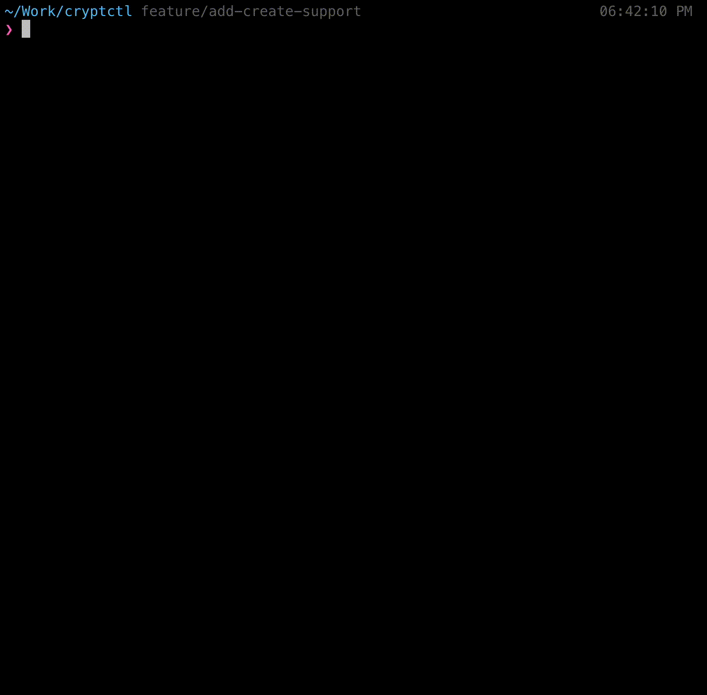

# `cryptctl` CLI Tool for managing [EncryptedSecrets](https://github.com/shubhindia/encrypted-secrets)


[](https://github.com/shubhindia/cryptctl/actions?query=workflow%3ACI+branch%3Amain)
[](http://www.apache.org/licenses/LICENSE-2.0.html)

## Note: `cryptctl` is currently a work in progress and is in the alpha stage. Please use it with caution in production environments.
## What is `cryptctl`?

**cryptctl** is a simple command-line interface (CLI) tool designed to facilitate the management of EncryptedSecrets.
With Cryptctl, you can easily update encrypted secrets within your Kubernetes cluster, ensuring the secure handling of sensitive information.

### Features
- **Effortless Encryption:** Cryptctl simplifies the process of encrypting secrets by providing a straightforward command-line interface. It handles the encryption and decryption operations seamlessly, making it easy to work with encrypted secrets in your Kubernetes environments.

- **Simplified Management:** Since, the secrets are encrypted, they can be easily stored in a repository. Once, the `EncryptedSecret` object is applied, `encrypted-secrets` controller takes care of decrypting the provided secrets and creates a k8s secret with decrpted values. Which can be access by the pod as required.


Here's a **`cryptctl`** demo:

- `cryptctl edit <filename>`


- `cryptctl create -f <filename> -p <provider>`



## Installation

- Linux: Download the latest release from [here](https://github.com/shubhindia/cryptctl/releases)

- Mac (you can use [Homebrew](https://brew.sh/) to install `cryptctl` on Mac):
```bash
brew tap shubhindia/cryptctl
brew install shubhindia/cryptctl/cryptctl
```

- Windows: Download the latest release from [here](https://github.com/shubhindia/cryptctl/releases)

# Usage
## Pre-requisites
- Make sure you have EDITOR environment variable set to your preferred editor. (e.g. `export EDITOR=vim`)
- Make sure you have a kubernetes cluster running and `kubectl` is configured to access the cluster in case of `k8s` provider and if you are using `aws-kms` provider make sure you have aws credentials configured.

## Commands
**1. init:** Initialize the encryption provider. This command will create an encryption certificate in the namespace provided if you are using `k8s` provider and will create a kms key if you are using `aws-kms` provider.

**2. create:** This command will create an `EncryptedSecret` object manifest with the provided inputs and provider.

**3. edit:** This command will open the provided `EncryptedSecret` object manifest in the editor provided by the EDITOR environment variable. Once the file is saved, it will create the `EncryptedSecret` object manifest which you can apply.

## Comparison with some other popular alternatives

| Tool     | Namespaced Encryption Keys | Multiple Providers Support | Auto Key Renewal | Client Side Decryption Support |
|:--------:|:------------------------:|:--------------------------:|:----------------:|:------------------------------:|
| cryptctl | ✅                        | ✅                          | ❌                | ✅                              |
| kubeseal | ❌                        | ❌                          | ✅                | ❌                              |
